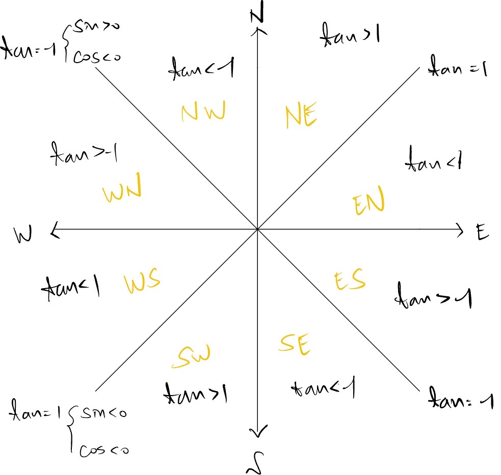

# 计算体积

找到cityobject的一个点，计算其他面和这个点形成的多面体的体积

- 多面体的体积可以分解为多个四面体的体积
  - 体积等于点到三角形的距离乘以三角形面积
  - 或者直接不分解，算面的面积和点到面的距离(需要鞋带公式，或者分解成oriented三角形面积和(不如前面的方法)
- 多面体体积的正负取决于这个点相对于其他面的orientation
  - 整个face选三个点计算determinant?可能会出现共线问题，所以用三角形


```
对每个cityobject:
	选定boundary的一个点 P0
    for each face:
        create triangulation:
        对第一个triangle和P0计算orientation
        for each triangle:
            calculate area
            calculate distance to P0
            volume += orientation*area*distance/3
            area += area
            保存area和volume到json object的attributes里，area(用于后续计算，最终删掉)
```


# 計算屋頂朝向

擷取RoofSurface之cdt，選擇其中一個三角形，依照其normal vector 朝向標註orientation
利用normal vector (x,y) 判斷方位



```
對每個building part:
  篩選RoofSurface
    for each pt of the RoofSurface
      compute its best_fitting_plane
      compute the normal vector of the best_fitting_plane
      extract the x,y coordinate values of the normal vector to determine the orientation 
      address the orientation

```